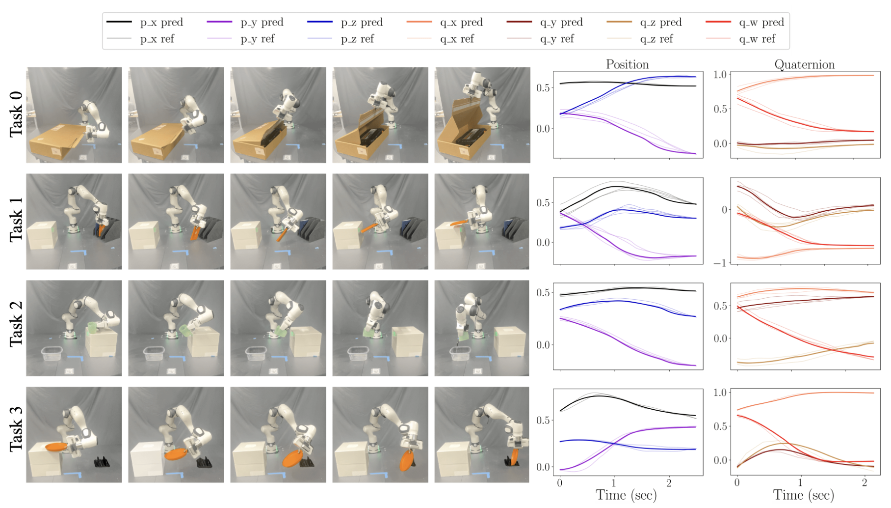

# SE(3) Linear Parameter Varying Dynamical Systems for Globally Asymptotically Stable End-Effector Control


| [Paper](https://arxiv.org/abs/2403.16366) | [Video](https://youtu.be/vdYUHrybR0U) |


This is the codebase for SE(3) Linear Parameter Varying Dynamical Systems, or SE(3) LPV-DS. To use this code, please follow the instruction below to pull the required dependencies including the [LPV-DS](https://github.com/SunannnSun/lpvds) and [quaternion-DS](https://github.com/sunan-sun/quaternion_ds.git), which are the modules for position and orientaion planning/control respectively.

<p align="center">
  
</p>


## Usage

### 1. Create a Virtual Environment

It is recommended to use a virtual environment with Python >= 3.9. You can create one using [conda](https://docs.conda.io/en/latest/):

```bash
conda create -n venv python=3.9
conda activate venv
```

### 2. Install Dependencies

Install the required Python packages and dependencies:

```bash
pip install -r requirements.txt
vcs import . < dependency.yaml
```

### 3. Run the Code

Edit `main.py` to select your dataset and run:

```bash
python main.py
```


## Reference

If you find this code useful for you project, please consider citing it.

```
@INPROCEEDINGS{10801844,
  author={Sun, Sunan and Figueroa, Nadia},
  booktitle={2024 IEEE/RSJ International Conference on Intelligent Robots and Systems (IROS)}, 
  title={SE(3) Linear Parameter Varying Dynamical Systems for Globally Asymptotically Stable End-Effector Control}, 
  year={2024}
}
```

## Contact

Contact: [Sunan Sun](https://sunan-sun.github.io/) (sunan@seas.upenn.edu)
